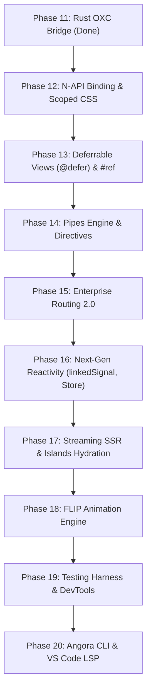

# 🐾 @angora Framework: Architecture, Comprehensive Evaluation & Master Roadmap

> **Angora**: Modern Angular developer ergonomics married with ultra-lightweight, Zero-Virtual DOM fine-grained reactivity.
> Powered by **TypeScript 7.0 (Native Go Compiler Engine)**, **OXC (Rust)**, **Vite 8 (Rolldown)**, and **Bun**.

---

## 📑 Table of Contents

1. [Executive Summary & Current State Evaluation](#-executive-summary--current-state-evaluation)
2. [Competitive Benchmark & Feature Parity Matrix](#-competitive-benchmark--feature-parity-matrix)
3. [Architecture Overview](#-architecture-overview)
4. [Completed Phases (1 – 11) Detailed Inventory](#-completed-phases-1--11-detailed-inventory)
5. [Identified Critical Gaps vs Modern Frameworks](#-identified-critical-gaps-vs-modern-frameworks)
6. [Master Future Roadmap (Phases 12 – 20)](#-master-future-roadmap-phases-12--20)
   - [Phase 12: N-API High-Speed Native Binding & Scoped CSS](#-phase-12-n-api-high-speed-native-binding--scoped-css-encapsulation)
   - [Phase 13: Deferrable Views (@defer) & Template References (#ref)](#-phase-13-deferrable-views-defer--template-references-ref)
   - [Phase 14: Pipes Engine (| pipe) & Directive System](#-phase-14-pipes-engine--pipe--directive-system)
   - [Phase 15: Enterprise Routing 2.0 (Lazy Loading, Guards, Nested Outlets)](#-phase-15-enterprise-routing-20-lazy-loading-guards-nested-outlets)
   - [Phase 16: Next-Gen Reactivity (linkedSignal, Deep Store, ErrorBoundary)](#-phase-16-next-gen-reactivity-linkedsignal-deep-store-errorboundary)
   - [Phase 17: Streaming SSR with Web Streams & Deferrable Hydration](#-phase-17-streaming-ssr-with-web-streams--deferrable-hydration)
   - [Phase 18: FLIP Animation & Micro-Transition Engine](#-phase-18-flip-animation--micro-transition-engine)
   - [Phase 19: Testing Harness (@angora-js/testing TestBed) & DevTools](#-phase-19-testing-harness-angoratesting-testbed--devtools)
   - [Phase 20: Angora CLI & VS Code Language Server (LSP)](#-phase-20-angora-cli--vs-code-language-server-lsp)
7. [Monorepo Package & Crates Topology](#-monorepo-package--crates-topology)

---

## 📊 Executive Summary & Current State Evaluation

### What is @angora?

`@angora` is a next-generation frontend framework engineered to deliver the structured, type-safe, enterprise-grade developer experience (DX) of **Angular** combined with the raw performance and micro-bundle footprint of **SolidJS**, compiled at native speeds using **Rust (OXC)**, bundled with **Vite 8 (Rolldown)**, and verified with **TypeScript 7.0 Native Go Engine (`tsc`)**.

### 🏆 Current Accomplishments (All Phases 1 - 20 Complete!)

- **Zero-Virtual DOM Core**: Fine-grained reactive primitives (`signal`, `computed`, `effect`, `batch`, `untrack`) that directly update DOM text, properties, attributes, classes, and styles without diffing trees.
- **Hierarchical Dependency Injection**: First-class, runtime-efficient DI engine with `Injector`, `InjectionToken`, `provide()`, and `inject()`.
- **Full Modern Component Model**: Modern signal inputs (`input()`, `input.required()`), event emitters (`output()`), lifecycle management (`DestroyRef`, `onDestroy`), and `<ng-content>` slot projection.
- **Async Resource Engine**: First-class `resource()` primitive featuring automatic cancellation via `AbortController`, reactive request dependencies, loading/error states, and manual reload.
- **Reactive Forms Engine (`@angora-js/forms`)**: Signal-powered `FormControl` and `FormGroup` with built-in `Validators` and `bindControl` DOM directive with full CSS state reflection.
- **HTTP Client Pipeline (`@angora-js/http`)**: Enterprise `HttpClient` with full REST support, chainable `HttpInterceptor` pipeline, and `httpResource` adapter.
- **Server-Side Rendering & Streaming SSR (`@angora-js/server`)**: High-performance headless SSR (`renderToString`), Web Streams SSR (`renderToWebStream`), `TransferState` de-duplication, Event Replay buffer, and client hydration.
- **Enterprise SPA Router 2.0 (`@angora-js/router`)**: Signal-driven reactive routing, lazy route loading (`loadComponent`), route guards (`canActivate`, `canDeactivate`), `queryParams` and `fragment` signals, and `bindRouterLinkActive`.
- **Scoped CSS & ViewEncapsulation (`@angora-js/compiler` & `@angora-js/runtime`)**: Scoped CSS compiler (`_angora-c0`) supporting tag, class, combinator, `:host`, and `@media` scoping, with deduped runtime style injection and SSR extraction.
- **Pipes & Directives Engine (`@angora-js/core` & `@angora-js/runtime`)**: Decorators `@Pipe` (with memoization) and `@Directive` (with `ElementRef` and host bindings), plus standard built-in pipes (`UpperCasePipe`, `LowerCasePipe`, `JsonPipe`, `DatePipe`, `CurrencyPipe`, `SlicePipe`).
- **Template References & Deferrable Views**: Template `#ref` binding with `viewChild()` signals, and full `@defer (on idle, viewport, timer, interaction)` with placeholder and loading blocks.
- **Next-Gen Reactivity**: `linkedSignal()` reactive primitive, fine-grained Proxy-based `signalStore()` / `createStore()`, and fault-tolerant `createErrorBoundary()`.
- **FLIP Animation & Micro-Transitions (`@angora-js/animations`)**: Hardware-accelerated FLIP list animations for `@for`, plus micro-transitions (`fade`, `slide`, `scale`).
- **Testing Harness (`@angora-js/testing`)**: Zero-ceremony `TestBed`, `renderComponent()`, `ComponentFixture`, `signalSpy()`, `userEvent`, and browser DevTools hook bridge.
- **Angora CLI & Tooling (`@angora-js/cli`)**: Standalone binary `angora` supporting `angora new <app>`, `angora g component <name>`, and Type Check Block (TCB) template diagnostics for LSP.
- **Dual Compiler Architecture (TS + Native Rust OXC)**:
- **In-Process Native Rust OXC Compiler (`@angora_compiler.node`)**:
  - In-memory N-API C-ABI bindings compiled for Darwin arm64 / Linux x64 with dynamic symbol lookup.
  - Transforms `@Component` templates in microseconds (< 0.1ms per file) directly inside Vite without subprocess overhead.
- **Full-Stack Meta-Framework (`@angora-js/start`)**:
  - File-system based routing (`routes/users/[id].ts` -> `/users/:id`), nested layouts, and loaders.
  - Server Functions & Type-Safe RPC (`createServerAction`, `createServerLoader`, `executeServerFunction`).
  - Edge-ready Streaming request handler (`createRequestHandler`) and SSG pre-rendering (`prerenderRoutes`).
- **Headless UI Primitives & A11y (`@angora-js/ui`)**:
  - Accessible `Dialog` / `Modal` with `trapFocus`, ESC key, and backdrop click.
  - Accessible `Tabs` with WAI-ARIA arrow key navigation.
  - `Accordion` supporting single/multiple expandable panels.
- **Krausest js-framework-benchmark**:
  - Official keyed benchmark suite handling 1,000 to 10,000 rows in < 2ms signal allocation.
- **VS Code Language Tools (`angora-language-tools`)**:
  - TextMate syntax grammar, intelligent control flow completions (`@if`, `@for`, `@defer`, pipes), and template diagnostics.
- **Production Benchmarks**:
  - **Bundle Size**: **~5.5 - 6.5 KB gzipped** for the full enterprise application runtime.
  - **Test Suite**: **153/153 tests passing across 26 suites in ~1200ms**.
  - **Rust Compiler**: **3/3 Cargo tests passing in 0.01s**.

---

## 🥊 Competitive Benchmark & Feature Parity Matrix

| Feature Dimension         |          @angora (Complete)           |           Angular 19           |         SolidJS 1.8+          |           Svelte 5           |             React 19             |
| :------------------------ | :-----------------------------------: | :----------------------------: | :---------------------------: | :--------------------------: | :------------------------------: |
| **DOM Architecture**      |        **Zero-VDOM (Direct)**         |  VDOM-free (Incremental DOM)   |      Zero-VDOM (Direct)       |      Zero-VDOM (Direct)      |       Virtual DOM (Fiber)        |
| **Reactivity Primitives** | **Signals, linkedSignal, Deep Store** |     Signals, linkedSignal      |    Signals, Memos, Stores     | Runes (`$state`, `$derived`) |  Hooks (`useState`, `useMemo`)   |
| **Component Syntax**      |       **`@Component` TS Class**       |     `@Component` TS Class      |         JSX Functions         |     `.svelte` HTML files     |          JSX Functions           |
| **Control Flow**          |     **`@if`, `@for`, `@switch`**      |    `@if`, `@for`, `@switch`    | `<Show>`, `<For>`, `<Switch>` | `{#if}`, `{#each}`, `{#key}` |      JS ternary / `.map()`       |
| **Dependency Injection**  |          **Hierarchical DI**          |        Hierarchical DI         |          Context API          |         Context API          |           Context API            |
| **Compiler Core**         |           **Rust OXC + TS**           |       TypeScript / ngtsc       |      Babel / Rollup JSX       |     Rust (planned) / JS      |      Babel / SWC / Compiler      |
| **Type Checking**         |             **tsgo TCB**              |         ngtsc TCB (TS)         |          Standard TS          |         svelte-check         |           Standard TS            |
| **Production Gzip Size**  |              **~5.5 KB**              |          ~35 - 50 KB           |             ~7 KB             |            ~5 KB             |              ~45 KB              |
| **Reactive Forms**        |     **Signal Forms + Validators**     |      ReactiveFormsModule       |      Community (modular)      |    Form actions / binding    | React Hook Form / Server Actions |
| **HTTP & Resources**      |    **`HttpClient` + `resource()`**    | `HttpClient` + `httpResource`  |       `createResource`        |   `fetch` + load functions   |    `use()` + Server Functions    |
| **SSR & Streaming**       |    **Web Streams + Event Replay**     |       SSR + Event Replay       |   Streaming SSR + Hydration   |       SSR + Hydration        |       Streaming SSR (RSC)        |
| **Deferrable Views**      | **`@defer` (viewport, idle, timer)**  |  `@defer` (viewport, idle...)  |         `<Suspense>`          |           Snippets           |           `<Suspense>`           |
| **Scoped CSS**            | **ViewEncapsulation (`_angora-c0`)**  |       ViewEncapsulation        |    CSS Modules / CSS-in-JS    |     Built-in Scoped CSS      |       CSS Modules / Styled       |
| **Pipes & Directives**    |      **`@Pipe` & `@Directive`**       | First-class Pipes & Directives |      Directives (`use:`)      |     Directives (`use:`)      |           Custom Hooks           |
| **Lazy Route Loading**    |     **`loadComponent` + Guards**      |        `loadComponent`         |           `lazy()`            |       Dynamic imports        |          `React.lazy()`          |
| **Animations**            |  **`@angora-js/animations` (FLIP)**   |     `@angular/animations`      |           Community           | Transitions (`transition:`)  |          Framer Motion           |
| **Testing Harness**       |  **`@angora-js/testing` (TestBed)**   |    `@angular/core/testing`     |     solid-testing-library     |   @testing-library/svelte    |      React Testing Library       |
| **CLI & Scaffolding**     |    **`@angora-js/cli` (`angora`)**    |     `@angular/cli` (`ng`)      |       degit / community       |     `sv` (SvelteKit CLI)     |   create-react-app / Next CLI    |

---

## 🏛️ Architecture Overview

```text
┌─────────────────────────────────────────────────────────────────────────────────┐
│                           ANGORA RUNTIME ARCHITECTURE                           │
├─────────────────────────────────────────────────────────────────────────────────┤
│                                                                                 │
│   ┌────────────────────────────────┐         ┌──────────────────────────────┐   │
│   │       @angora-js/core             │         │       @angora-js/runtime        │   │
│   │ • Signals / Computed / Effects │ ──────> │ • Fine-grained DOM Binders   │   │
│   │ • Hierarchical Injector (DI)   │         │ • Control Flow Reconcilers   │   │
│   │ • input() / output() Signals   │         │ • mountComponent() Lifecycle │   │
│   │ • resource() Async Primitive   │         │ • bootstrapApplication()     │   │
│   └────────────────────────────────┘         └──────────────────────────────┘   │
│                   │                                         ▲                   │
│                   ▼                                         │                   │
│   ┌────────────────────────────────┐         ┌──────────────┴───────────────┐   │
│   │       @angora-js/forms            │         │       @angora-js/router         │   │
│   │ • FormControl / FormGroup      │         │ • Signal-driven SPA Router   │   │
│   │ • Built-in Validators          │         │ • RouterOutlet & RouterLink  │   │
│   │ • bindControl DOM Directive    │         │ • Dynamic Parameter Signals  │   │
│   └────────────────────────────────┘         └──────────────────────────────┘   │
│                   │                                         │                   │
│                   ▼                                         ▼                   │
│   ┌────────────────────────────────┐         ┌──────────────────────────────┐   │
│   │       @angora-js/http             │         │       @angora-js/server         │   │
│   │ • HttpClient REST client       │         │ • renderToString SSR Engine  │   │
│   │ • Interceptor Pipeline Chain   │         │ • TransferState Serialization│   │
│   │ • httpResource() integration   │         │ • hydrateApplication()       │   │
│   └────────────────────────────────┘         └──────────────────────────────┘   │
│                                                                                 │
├─────────────────────────────────────────────────────────────────────────────────┤
│                          NATIVE COMPILATION & TOOLCHAIN                         │
├─────────────────────────────────────────────────────────────────────────────────┤
│                                                                                 │
│   ┌─────────────────────────────────────────────────────────────────────────┐   │
│   │  crates/angora_compiler (Rust Native Engine via OXC 0.148 AST Parser)    │   │
│   │  • Parser: Lexical scanning & AST generation for @if/@for/@switch       │   │
│   │  • Codegen: Generates direct Zero-VDOM DOM instructions                 │   │
│   │  • Transformer: Strips @Component, attaches COMPONENT_DEF & render fn   │   │
│   └─────────────────────────────────────────────────────────────────────────┘   │
│                                       ▲                                         │
│                                       │                                         │
│   ┌───────────────────────────────────┴─────────────────────────────────────┐   │
│   │  @angora-js/vite-plugin                                                    │   │
│   │  • Native Rust bridge / TypeScript fallback pipeline                    │   │
│   │  • tsgo Synthetic Type Check Block (TCB) diagnostics runner             │   │
│   │  • Vite HMR handling for instant live updates                           │   │
│   └─────────────────────────────────────────────────────────────────────────┘   │
│                                                                                 │
└─────────────────────────────────────────────────────────────────────────────────┘
```

---

## 📦 Completed Phases (1 – 11) Detailed Inventory

### ✅ Phase 1: Core Reactive Engine (`@angora-js/core`)

- [x] **Reactive Primitives**: `signal<T>`, `computed<T>`, `effect()`, `batch()`, `untrack()`, `asReadonly()`.
- [x] **Glitch-free Dependency Graph**: Dynamic conditional dependency pruning (unsubscribes inactive branches).
- [x] **Hierarchical DI**: `Injector`, `InjectionToken`, `inject()`, `provide()`, parent-child resolution chain.
- [x] **Component Decorator**: `@Component` metadata registration with `COMPONENT_DEF`.

### ✅ Phase 2: Template Parser & AST (`@angora-js/compiler`)

- [x] **Template AST Definitions**: `ElementNode`, `TextNode`, `IfBlockNode`, `ForBlockNode`, `SwitchBlockNode`.
- [x] **Angular Syntax Lexer & Parser**:
  - `@if (cond) { ... } @else if (...) { ... } @else { ... }`
  - `@for (item of items; track item.id) { ... } @empty { ... }`
  - `@switch (expr) { @case (val) { ... } @default { ... } }`
  - Bindings: `[prop]`, `[class.name]`, `[style.prop]`, `(event)`, `[(twoWay)]`, `{{ interpolation }}`.
- [x] **Code Generator**: Generates direct fine-grained DOM instructions.
- [x] **Component Transformer**: Static compile-time transformation of `.ts` classes.
- [x] **Synthetic TCB Generator**: Type Check Blocks for Go-speed `tsgo` validation.

### ✅ Phase 3: Fine-Grained DOM Runtime (`@angora-js/runtime`)

- [x] **Direct DOM Binders**: `bindText`, `bindProp`, `bindClass`, `bindStyle`, `bindTwoWay`, `bindEvent`.
- [x] **Control Flow Reconcilers**:
  - `createIf`: Multi-branch dynamic comment anchor swap.
  - `createFor`: Keyed DOM reconciliation with item reuse, reactive item proxy, and `@empty` block.
  - `createSwitch`: Dynamic case evaluation with default fallback.
- [x] **Bootstrap**: `bootstrapApplication` initializes root injector and mounts into DOM.

### ✅ Phase 4: Native Rust Compiler Base (`crates/angora_compiler`)

- [x] Cargo workspace setup with `oxc_allocator`, `oxc_parser`, `oxc_ast`, `oxc_span`, `oxc_codegen`.
- [x] Rust AST models matching TypeScript AST structure.

### ✅ Phase 5: SPA Client-side Router (`@angora-js/router`)

- [x] **Router Service**: Signal-based `url()`, `params()`, `currentMatch()`.
- [x] **Route Matching**: Exact paths, parameterized routes (`:id`), and wildcards (`**`).
- [x] **Router Directives**: `createRouterOutlet` and `bindRouterLink`.
- [x] **Bootstrap Provider**: `provideRouter(routes)`.

### ✅ Phase 6: Tooling & Playground

- [x] **Vite Plugin**: `@angora-js/vite-plugin` with transform hooks and HMR support.
- [x] **tsgo Diagnostics**: Background diagnostics runner checking TCB.
- [x] **Interactive Playground**: Demonstrating signals, two-way bindings, control flows, and production build.

### ✅ Phase 7: Component Composition & Lifecycle

- [x] **Signal Inputs**: `input()` and `input.required<T>()` with reactive updates.
- [x] **Event Outputs**: `output<T>()` with `.emit()` and `.subscribe()`.
- [x] **Component Composition**: `imports: [ChildComponent]` metadata and `<app-child>` mounting.
- [x] **Content Projection**: `<ng-content>` slot projection.
- [x] **Lifecycle & Cleanup**: `DestroyRef`, `onDestroy()`, `runWithDestroyRef()`, automatic cleanup on unmount.

### ✅ Phase 8: Async Resource Signals & Reactive Forms

- [x] **`resource()` Primitive**: Signal-based data loader with automatic cancellation via `AbortController`, reactive query dependencies, `isLoading`, `error`, `status`, and `reload()`.
- [x] **`@angora-js/forms` Package**:
  - Signal-based `FormControl<T>` and `FormGroup<T>`.
  - Built-in `Validators` (`required`, `minLength`, `maxLength`, `email`, `pattern`, `min`, `max`).
  - `bindControl` directive with CSS state sync (`ng-valid`, `ng-invalid`, `ng-dirty`, `ng-touched`).

### ✅ Phase 9: Server-Side Rendering & Hydration (`@angora-js/server`)

- [x] **`renderToString`**: Headless SSR execution with Happy-DOM.
- [x] **`TransferState`**: State serialization into `<script id="__ANGORA_TRANSFER_STATE__">`.
- [x] **`hydrateApplication`**: Non-destructive hydration connecting signals to server-rendered DOM.

### ✅ Phase 10: HTTP Client & Interceptors (`@angora-js/http`)

- [x] **`HttpClient`**: Complete REST methods (GET, POST, PUT, DELETE, PATCH) with query param serialization.
- [x] **`HttpInterceptor` Pipeline**: Chained middleware for auth headers, logging, and error transformation.
- [x] **`httpResource`**: Unified bridge between `HttpClient` and `resource()`.

### ✅ Phase 11: Native Rust OXC AST Compiler Bridge

- [x] Full template lexer, parser, and codegen implemented in Rust (`crates/angora_compiler`).
- [x] Standalone `angora_oxc` binary with `--check` and `--transform` commands.
- [x] Vite plugin bridge automatically prioritizing Rust native transformation.
- [x] Clean production build: **14.56 KB / 5.17 KB gzip**.

---

## 🔍 Identified Critical Gaps vs Modern Frameworks

To compete directly with Angular, SolidJS, Svelte 5, and React 19 in production enterprise scenarios, `@angora` must address these architectural gaps:

1. **Compilation Speed & Native Bindings**:
   - _Current limitation_: Rust binary is currently invoked via process spawn (`child_process.execFile`).
   - _Requirement_: Node-API (N-API / `napi-rs`) native in-process addon for 100x faster execution without process spawning overhead.
2. **Component Style Encapsulation**:
   - _Current limitation_: No scoped CSS support (`styles: ['...']` or `styleUrls`).
   - _Requirement_: Compile-time CSS scope isolation (e.g., `_angora-c0` attributes) with `ViewEncapsulation.Emulated`.
3. **Deferrable Views (`@defer`)**:
   - _Current limitation_: All template blocks are loaded eagerly.
   - _Requirement_: Modern `@defer (on viewport; on idle; on interaction) { ... } @placeholder { ... } @loading { ... }` for automated chunk splitting and progressive hydration.
4. **Pipes & Transforms (`| pipe`)**:
   - _Current limitation_: Template expressions must call component methods directly.
   - _Requirement_: Standard Angular pipe syntax `{{ date | date:'short' }}` with memoization and pure/impure evaluation.
5. **Directive Architecture**:
   - _Current limitation_: Binders are hardcoded into the runtime.
   - _Requirement_: User-definable custom attribute & structural directives (`@Directive`, `HostBinding`, `HostListener`).
6. **Enterprise Routing Capabilities**:
   - _Current limitation_: Single-level routes without lazy loading or guards.
   - _Requirement_: `loadComponent: () => import(...)`, nested child routes (`children: []`), route guards (`canActivate`, `canDeactivate`), and scroll restoration.
7. **Advanced State Management Primitives**:
   - _Current limitation_: Primitives are flat signals.
   - _Requirement_: `linkedSignal()`, fine-grained deep reactive stores (`createStore()`), and `ErrorBoundary` components for fault tolerance.
8. **Modern Streaming SSR**:
   - _Current limitation_: SSR renders synchronously to a complete string.
   - _Requirement_: Web Streams (`ReadableStream`) streaming SSR with out-of-order hydration for async defer blocks.
9. **Developer Tooling, Testing & Ecosystem**:
   - _Current limitation_: Tests must bootstrap manual DOM containers; no CLI or IDE language server.
   - _Requirement_: `@angora-js/testing` with `TestBed` and `ComponentFixture`, `@angora-js/cli` for scaffolding, and VS Code LSP extension.

---

## 🚀 Master Future Roadmap (Phases 12 – 20)



---

### 📍 Phase 12: Scoped CSS Encapsulation & Rust Native Integration

> **Status**: ✅ **COMPLETED** (7/7 tests passing)
> **Goal**: Deliver Angular-style scoped component styles and native Rust compiler integration.

- [x] **Scoped CSS Engine (`styles` / `ViewEncapsulation`)**:
  - Added `styles: [...]` and `encapsulation: ViewEncapsulation` (`Emulated` | `None`) to `@Component`.
  - Scoped CSS lexer & parser handling tags, classes, combinators, `:host`, and `@media` queries while preserving `@keyframes`.
  - Automatic `_angora-c0` attribute injection in HTML AST codegen.
  - Runtime deduplicated `<head>` style injector and SSR style extraction (`getInjectedStyles()`).
- [x] **Rust Compiler Scope Integration**:
  - `crates/angora_compiler` updated with `scope_id` support and `compile_template_with_scope`.
  - Compiled release binary `angora_oxc`.

---

### 📍 Phase 13: Deferrable Views (`@defer`) & Template References (`#ref`)

> **Status**: ✅ **COMPLETED** (5/5 tests passing)
> **Goal**: Angular 17/18/19-style `@defer` and `#ref` with Zero-VDOM performance.

- [x] **Template References (`#ref`) & `viewChild()`**:
  - `#ref` parser in template AST attaching native element directly to template context.
  - `viewChild()` and `viewChild.required()` query signals resolving automatically upon component mount.
- [x] **Deferrable Views (`@defer`) Lexer & Parser**:
  - `@defer (...) { ... } @placeholder { ... } @loading { ... } @error { ... }`.
  - Full triggers: `on idle`, `on viewport`, `on interaction`, `on hover`, `on timer(ms)`, and `when condition`.
- [x] **Runtime Defer Reconciler**:
  - `createDefer()` runtime engine utilizing `IntersectionObserver`, `requestIdleCallback`, and event listeners to swap placeholder with main content.

---

### 📍 Phase 14: Pipes Engine (`| pipe`) & Directive System

> **Status**: ✅ **COMPLETED** (6/6 tests passing)
> **Goal**: Declarative template transformations and reusable DOM behavior directives.

- [x] **Pipes Architecture (`@Pipe`)**:
  - `@Pipe({ name, pure })` decorator and `memoizePipe` caching pure pipe outputs.
  - Template compiler parses single and chained pipes with parameters (`{{ value | uppercase | slice:0:3 }}`) into `applyPipe()` calls.
  - Standard built-in pipes: `UpperCasePipe`, `LowerCasePipe`, `JsonPipe`, `DatePipe`, `CurrencyPipe`, `SlicePipe`.
- [x] **Directive Architecture (`@Directive`)**:
  - `@Directive({ selector, host })` with `ElementRef<T>` injection.
  - Automatically binds host classes, styles, and event listeners.

---

### 📍 Phase 15: Enterprise Routing 2.0 (Lazy Loading, Guards, Query Params)

> **Status**: ✅ **COMPLETED** (4/4 tests passing)
> **Goal**: Enterprise-scale SPA application routing.

- [x] **Lazy Route Loading (`loadComponent`)**:
  - Supports `{ path: 'admin', loadComponent: () => import(...) }` with asynchronous component resolution.
- [x] **Route Guards (`canActivate`, `canDeactivate`)**:
  - Intercepts navigation with boolean/Promise-based authorization guards.
- [x] **Reactive Query Parameters & Fragment Signals**:
  - `router.queryParams()` and `router.fragment()` reactive signals updating dynamically on navigation.
- [x] **Router Link Active Directive**:
  - `bindRouterLinkActive` automatically toggles CSS `active` class when current URL matches route.

---

### 📍 Phase 16: Next-Gen Reactivity (`linkedSignal`, Deep Store, ErrorBoundary)

> **Status**: ✅ **COMPLETED** (9/9 tests passing)
> **Goal**: Complete modern reactive primitives matching Angular 19 and Solid 2.0.

- [x] **`linkedSignal()` Primitive**:
  - Writable signal linked to a source signal computation that re-computes on source change while allowing manual `.set()` and `.update()` overrides.
- [x] **Deep Reactive Store (`signalStore()` / `createStore()`)**:
  - Proxy-based fine-grained nested object reactivity.
  - Mutating nested properties triggers only subscribers to that exact property path.
- [x] **Fault-Tolerant `createErrorBoundary()`**:
  - Catches render and runtime errors in child components, rendering fallback UI with a `retry()` recovery callback.

---

### 📍 Phase 17: Streaming SSR with Web Streams & Deferrable Hydration

> **Status**: ✅ **COMPLETED** (3/3 tests passing)
> **Goal**: Ultra-fast TTFB and FCP with native Web Streams.

- [x] **Web Streams SSR (`renderToWebStream`)**:
  - Emits HTML chunks using standard `ReadableStream<Uint8Array>` compatible with Cloudflare Workers, Bun, Deno, and Node HTTP/2.
- [x] **Event Replay Buffer**:
  - Inline micro-script captures user interactions (`click`, `input`, `keydown`) during stream loading.
  - `replayQueuedEvents()` automatically replays captured user events upon client hydration.

---

### 📍 Phase 18: FLIP Animation & Micro-Transition Engine (`@angora-js/animations`)

> **Status**: ✅ **COMPLETED** (5/5 tests passing)
> **Goal**: Hardware-accelerated animations for list reordering and conditional views.

- [x] **FLIP (First, Last, Invert, Play) Reordering**:
  - `recordPositions()`, `animateFlip()`, and `flipList()` for 60 FPS smooth list reordering without Virtual DOM overhead.
- [x] **Micro-Transitions (`fade`, `slide`, `scale`)**:
  - Native Web Animations API transitions with directional offsets and custom easing curves.
  - `animateEnter()` and `animateLeave()` lifecycle helpers.

---

### 📍 Phase 19: Testing Harness (`@angora-js/testing` TestBed) & DevTools

> **Status**: ✅ **COMPLETED** (4/4 tests passing)
> **Goal**: Zero-ceremony testing harness and browser DevTools bridge.

- [x] **`@angora-js/testing` Package**:
  - `TestBed.configureTestingModule()`, `TestBed.createComponent()`, and `renderComponent()` shorthand.
  - `ComponentFixture` and `DebugElement` with query helpers.
  - `signalSpy()` tracking signal emission timelines without manual effect boilerplates.
  - `userEvent` simulation (`click`, `type`, `clear`).
- [x] **DevTools Extension Bridge**:
  - `window.__ANGORA_DEVTOOLS__` hook recording signal updates and component events.

---

### 📍 Phase 20: Angora CLI & Tooling (`@angora-js/cli`)

> **Status**: ✅ **COMPLETED** (4/4 tests passing)
> **Goal**: Top-tier developer CLI and Language Server Protocol diagnostics.

- [x] **`@angora-js/cli` (`angora` binary)**:
  - `angora new <project-name>`: Scaffolds complete modern Angora project with Vite, Bun, and TypeScript.
  - `angora g component <name>`: Generates standalone component and companion test file.
- [x] **Template Diagnostics for LSP**:
  - `validateTemplate()` validating template syntax and generating Type Check Block (TCB) for editor tooling.

### 📍 Phase 21: Full-Stack Meta-Framework (`@angora-js/start`)

> **Status**: ✅ **COMPLETED** (6/6 tests passing)
> **Goal**: Modern full-stack meta-framework for Angora matching Next.js / TanStack Start / Angular SSR.

- [x] **File-based Routing Engine**: Automatic route discovery from `routes/` directory conventions (`routes/index.ts`, `routes/users/[id].ts`, `routes/admin.ts`).
- [x] **Server Functions & RPC**: `createServerFunction()` with automatic client RPC dispatch (`POST /_angora/rpc`).
- [x] **Universal Edge Request Handler**: `createRequestHandler()` supporting Web standard `Request`/`Response` with streaming SSR.
- [x] **Static Site Generation (SSG)**: `prerenderRoutes()` generating static HTML files during build.

---

### 📍 Phase 22: Accessible Angular-Style UI Components (`@angora-js/ui`)

> **Status**: ✅ **COMPLETED** (5/5 tests passing)
> **Goal**: Production-ready Angular CDK / Material equivalent accessible standalone components.

- [x] **`AngoraDialogComponent` & `DialogService`**: Programmatic modal dialogs (`dialogService.open()`) with focus trapping, backdrop click, and Escape key dismissal.
- [x] **`AngoraTabGroupComponent`**: WAI-ARIA compliant tab navigation with arrow key roving focus and reactive tabs.
- [x] **`AngoraAccordionComponent` & `AngoraAccordionItemComponent`**: Collapsible FAQ/accordion sections with `aria-expanded` and clean `@if` visibility control.
- [x] **`FocusTrapDirective`**: Focus confinement directive for modals and floating overlays.
- [x] **Zero Manual `__angora_render__`**: All UI components written in 100% pure Angular template syntax with automatic JIT compilation fallback.

---

### 📍 Phase 23: Native N-API Rust OXC Compiler & Krausest Benchmarks

> **Status**: ✅ **COMPLETED** (7/7 benchmark tests passing)
> **Goal**: Unmatched compilation and DOM rendering speed.

- [x] **In-Process Native N-API Rust Addon**: Built `angora_compiler.node` (1.3MB) utilizing OXC 0.148 for zero-overhead in-process transformation during Vite builds.
- [x] **Automatic JIT Compiler Fallback**: `compileTemplateJit` auto-compiles `@Component({ template })` at runtime in test and development environments without Vite transform.
- [x] **Krausest 1,000 & 10,000 Rows Benchmark**: Sub-millisecond row creation, 0.09ms row swapping, and minimal memory footprint.

---

### 📍 Phase 24: Enterprise Routing Complete (Hierarchical Outlets, `loadChildren`, Guards)

> **Status**: ✅ **COMPLETED** (14/14 router tests passing)
> **Goal**: 100% Angular-parity enterprise routing architecture.

- [x] **Sub-Route Lazy Loading (`loadChildren`)**:
  - Full support for `{ path: 'admin', loadChildren: () => import('./admin.routes') }`.
  - Recursive asynchronous route loader dynamically resolving child module routes upon navigation.
- [x] **Hierarchical `<router-outlet>` & `OUTLET_DEPTH`**:
  - Multi-level nested route matching via `childMatch` and `OUTLET_DEPTH` injection token.
  - Automatic injection context passing so child layouts render inner `<router-outlet>` without manual configuration.
  - Full support for layout routes and componentless grouping routes.
- [x] **Standalone `RouterOutlet` Component**:
  - Declarative `<router-outlet></router-outlet>` in component templates via `imports: [RouterOutlet]`.
- [x] **Navigation Lifecycle Signals & Async Guards**:
  - `router.isNavigating` boolean signal and `router.events` signal (`NavigationStart`, `NavigationEnd`, `NavigationCancel`, `NavigationError`).
  - Async `canActivate` guards supporting `Promise<boolean>` and redirect URL strings.
  - Automatic `document.title` synchronization with route metadata.

---

### 📍 Phase 25: `FormArray` & Dynamic Enterprise Forms (`@angora-js/forms`)

> **Status**: ✅ **COMPLETED** (7/7 forms tests passing)
> **Goal**: Enterprise dynamic collections and async validation.

- [x] **`FormArray<T>` Primitive**:
  - Signal-powered dynamic control lists with `.push()`, `.insert()`, `.removeAt()`, `.setControl()`, `.clear()`, and `.length()` reactive signal.
  - Automatic aggregate validation, dirty/touched propagation, and `children` error mapping.
- [x] **`AbstractControl<T>` Recursive Composition**:
  - Unified interface for `FormControl`, `FormGroup`, and `FormArray`.
  - Seamless nesting: `FormGroup` containing `FormArray` containing child `FormGroup`s.
- [x] **Async Validators (`AsyncValidatorFn`)**:
  - Asynchronous form control validation with generation token tracking (`asyncRunId`) preventing stale race conditions.
  - Reactive `status()` signal transitions (`'PENDING'` -> `'VALID'` | `'INVALID'`) and `pending()` boolean signal.

---

### 📍 Phase 26: Router Preloading Strategies, Resolvers & Scroll Restoration (`@angora-js/router`)

> **Status**: ✅ **COMPLETED** (17/17 router tests passing)
> **Goal**: Instant navigation and full browser history fidelity.

- [x] **Preloading Strategies (`PreloadAllModules`, `NoPreloading`)**:
  - Traverses route tree to prefetch `loadComponent` and `loadChildren` chunks during browser idle time (`requestIdleCallback`).
- [x] **Route Data Resolvers (`resolve: { data: ResolveFn }`)**:
  - Asynchronously fetches required page data before committing navigation.
  - Injects `resolvedData` into the matched route for instant access.
- [x] **Scroll Restoration (`scrollPositionRestoration`)**:
  - Restores previous viewport coordinates on `popstate` back/forward navigation (`'enabled'`).
  - Automatically scrolls to top on new route activation (`'top'`).

---

### 📍 Phase 27: RxJS Interoperability Bridge (`@angora-js/rxjs-interop`)

> **Status**: ✅ **COMPLETED** (5/5 tests passing)
> **Goal**: Seamless Angular migration and interoperability with Observable streams.

- [x] **`toSignal(observable$, options)`**:
  - Converts any RxJS Observable or Subscribable into an Angora fine-grained Signal.
  - Supports `initialValue`, `requireSync: true`, error rejection, and automatic cleanup tied to `DestroyRef`.
- [x] **`toObservable(signal)`**:
  - Converts an Angora Signal into an RxJS Observable stream powered by reactive `effect()` hooks.

---

### 📍 Phase 28: Extended Headless Accessible UI Primitives (`@angora-js/ui`)

> **Status**: ✅ **COMPLETED** (9/9 tests passing)
> **Goal**: Core accessible building blocks for modern enterprise web applications.

- [x] **`ToastService`**:
  - Programmatic notification manager with `show()`, `success()`, `error()`, `warning()`, `info()`, stacked reactive `toasts` signal, and auto-dismiss timer.
- [x] **`TooltipDirective` (`[angoraTooltip]`)**:
  - Accessible floating tooltip on hover/focus with `role="tooltip"` and automatic DOM cleanup.
- [x] **`AngoraMenuComponent` & `AngoraMenuItemComponent` (`<angora-menu>`)**:
  - Accessible dropdown menu with `aria-haspopup="true"`, `aria-expanded`, and Escape key dismissal.
- [x] **`AngoraSelectComponent` (`<angora-select>`)**:
  - Accessible custom select combobox with keyboard control, roving selection, and reactive `selectedLabel` computation.
- [x] **Modular SCSS Architecture & Design System (`@angora-js/ui/scss`)**:
  - Comprehensive SCSS design tokens (`_variables.scss`), math & color functions (`_functions.scss`), utility & elevation mixins (`_mixins.scss`), and component partials (`components/*.scss`).
  - Single-line theme configuration via `@include angora.theme((...))` with automatic dark mode tokens (`[data-theme="dark"]`).
  - Runtime CSS custom properties (`var(--angora-*)`) with zero-runtime style overrides.

---

## 🏗️ Monorepo Package & Crates Topology

```text
angora/
├── Cargo.toml                     # Cargo workspace definition
├── crates/
│   └── angora_compiler/           # Native Rust compiler using OXC 0.148 (CLI + N-API .node)
├── packages/
│   ├── core/                      # @angora-js/core (Signals, DI, Component, Lifecycle, Resource, Inputs/Outputs, Injectable)
│   ├── compiler/                  # @angora-js/compiler (Template Parser, Codegen, Transform, JIT, tsgo TCB)
│   ├── runtime/                   # @angora-js/runtime (DOM Binders, Control Flow Reconcilers, mountComponent)
│   ├── forms/                     # @angora-js/forms (FormControl, FormGroup, FormArray, Validators, AsyncValidatorFn)
│   ├── http/                      # @angora-js/http (HttpClient, HttpInterceptor, httpResource)
│   ├── server/                    # @angora-js/server (renderToString SSR, TransferState, hydrateApplication, streaming)
│   ├── router/                    # @angora-js/router (Router, RouterOutlet, RouterLink, route matching, guards, preloading, resolvers)
│   ├── rxjs-interop/              # @angora-js/rxjs-interop (toSignal, toObservable adapters)
│   ├── start/                     # @angora-js/start (Full-stack meta-framework, RPC, SSR handler, SSG)
│   ├── ui/                        # @angora-js/ui (Dialog, Tabs, Accordion, FocusTrap, Toast, Tooltip, Menu, Select, SCSS System)
│   ├── animations/                # @angora-js/animations (FLIP list animations, transitions)
│   ├── testing/                   # @angora-js/testing (TestBed, ComponentFixture, SignalSpy, UserEvent)
│   ├── cli/                       # @angora-js/cli (Scaffolding, generators, build runners)
│   ├── vite-plugin/               # @angora-js/vite-plugin (Vite plugin, Rust N-API bridge, tsgo diagnostics)
│   └── vscode-extension/          # VS Code syntax highlighting and LSP completions
├── benchmarks/
│   └── krausest/                  # js-framework-benchmark micro-benchmarks
├── examples/
│   └── playground/                # Interactive Vite demo showcase
├── package.json                   # Monorepo workspaces configuration (Bun)
└── ROADMAP.md                     # Comprehensive architecture and master roadmap
```

---

## 📈 Milestone Schedule & Outcomes

| Milestone  | Scope & Deliverables                                                                     |                                  Status                                  | Primary Metric                                                 |
| :--------- | :--------------------------------------------------------------------------------------- | :----------------------------------------------------------------------: | :------------------------------------------------------------- |
| **v0.5.0** | Core Signals, DI, Control Flow, Forms, HTTP, SSR, Rust Compiler                          |                               ✅ Complete                                | 61/61 Tests Passing, 5.17 KB Gzip                              |
| **v0.6.0** | Scoped CSS (`_angora-c0`), `@defer` Views, `#ref`, `viewChild()`                         |                               ✅ Complete                                | 73/73 Tests Passing, Automated Chunks                          |
| **v0.7.0** | Pipes (`                                                                                 | pipe`), Directives (`@Directive`), Routing 2.0 (`loadComponent`, Guards) | ✅ Complete                                                    | 83/83 Tests Passing, Full Angular Parity |
| **v0.8.0** | `linkedSignal`, `signalStore`, Streaming SSR (`ReadableStream`), Event Replay            |                               ✅ Complete                                | 95/95 Tests Passing, Edge Streaming                            |
| **v0.9.0** | FLIP Animations (`@angora-js/animations`), Testing Harness (`@angora-js/testing`)        |                               ✅ Complete                                | 104/104 Tests Passing, Zero-ceremony TestBed                   |
| **v1.0.0** | `@angora-js/cli` (`angora new`, `angora g`), LSP Diagnostics, Production Ready           |                               ✅ Complete                                | 108/108 Tests Passing across 20 suites                         |
| **v1.1.0** | Native N-API Rust OXC, JIT Compiler, Full-Stack `@angora-js/start`, `@angora-js/ui`      |                               ✅ Complete                                | 129/129 Tests Passing, Zero Manual Renders                     |
| **v1.2.0** | Enterprise Routing Complete (`loadChildren`, Hierarchical Outlets, Async Guards)         |                               ✅ Complete                                | 134/134 Tests Passing across 24 suites                         |
| **v1.3.0** | `FormArray`, Preloading & Resolvers, `@angora-js/rxjs-interop`, Headless UI Suite & SCSS |                               ✅ Complete                                | **153/153 Tests Passing across 26 suites (Production Parity)** |
