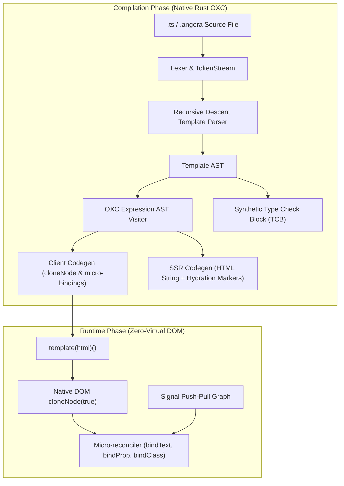

# 🏛️ Angora Internal Architecture

This document details the internal systems, compiler passes, and runtime algorithms that power the **Angora** web framework.



---

## 1. The Reactive Engine: Push-Pull Glitch-Free Signals

Angora's reactive core ([`packages/core/src/signals.ts`](file:///Users/truong/Documents/product/angora/packages/core/src/signals.ts)) guarantees $O(1)$ mutation scheduling and eliminates transitional glitch states:

1. **Two-Phase Graph Evaluation**:
   - **Push Phase**: When a `signal.set(val)` occurs, dirty flags propagate downstream to consumers without recomputing values immediately.
   - **Pull Phase**: When a `computed()` or active `effect()` requests a value, nodes reconcile lazily by inspecting their version counters (`epoch`). If upstream dependencies have not modified their actual values, recalculation is skipped.
2. **Glitch Prevention**:
   Diamond dependency graphs ($A \rightarrow B, C \rightarrow D$) evaluate in strict topological order, ensuring $D$ never reads an inconsistent state where $B$ has updated but $C$ has not.
3. **Automatic Event Batching**:
   Mutations inside event handlers or `batch(() => { ... })` defer downstream effect notifications until the outermost batch exits, collapsing multiple DOM writes into a single synchronous frame.

---

## 2. Zero-Virtual-DOM Runtime: Direct Template Cloning

Unlike Virtual-DOM frameworks that build a secondary JavaScript object tree on every state change, Angora treats HTML elements as static blueprints instantiated directly by the browser's C++ engine:

1. **Template Pre-fabrication**:
   The compiler produces an optimized HTML string representing the static structure of a component:
   ```typescript
   const tpl = template('<div class="card"><h2 class="title"></h2><button>Click</button></div>');
   ```
2. **C++ Native Cloning**:
   `tpl()` invokes `root.cloneNode(true)`. Modern browser rendering engines (V8, JavaScriptCore) clone DOM subtrees in native C++ code orders of magnitude faster than constructing individual `document.createElement()` nodes.
3. **Surgical Micro-Bindings**:
   Dynamic expressions are bound directly to their target DOM nodes using indexed child path navigation:
   ```typescript
   const root = tpl();
   const titleNode = root.firstChild.firstChild; // Direct path navigation
   bindText(titleNode, () => ctx.title()); // Surgical update
   ```
   When `ctx.title()` changes, only `titleNode.nodeValue` is updated. No parent re-rendering, no diffing.

---

## 3. Native Rust Compiler Engine (`angora_compiler`)

Written in Rust 2021 using [OXC](https://github.com/oxc-project/oxc) for maximum compilation speed ($<0.1\text{ms}$ per file):

### A. Strict Formal Lexer (`token.rs`, `lexer.rs`)

- Tokenizes templates with exact byte offset source spans (`SourceSpan`).
- Enforces strict boundary verification for control flow blocks (`@if`, `@for`, `@switch`, `@defer`), ensuring that email addresses or text containing `@` symbols are never mistakenly parsed as control flow keywords.

### B. OXC Expression AST Visitor (`expr_transform.rs`)

- Parses embedded template expressions into a standard JavaScript AST using `oxc_parser`.
- Applies `VisitMut` transformations:
  - **Scope preservation**: Variables bound in arrow functions (`item => item.name`) or destructuring are preserved without prefixing.
  - **Object shorthand expansion**: `{ user, active }` expands to `{ user: ctx.user, active: ctx.active }`.
  - **Contextual variable wrapping**: Loop variables like `$index` are wrapped into signal invocations (`$index()`).
  - **Signals invocation**: Signal identifiers are transformed to callable getters (`ctx.count()`).

### C. Synthetic Type Check Block (TCB) Engine

- Generates invisible TypeScript blocks reflecting the template's types against the component class.
- Emits two-way source coordinate maps, enabling real-time error reporting where TypeScript compiler diagnostics point directly to template line and column numbers.

---

## 4. Server-Side Rendering (SSR) & In-Place Hydration

The SSR engine ([`packages/server`](file:///Users/truong/Documents/product/angora/packages/server) & [`crates/angora_compiler/src/ssr_codegen.rs`](file:///Users/truong/Documents/product/angora/crates/angora_compiler/src/ssr_codegen.rs)):

1. **Hydration Markers**:
   Server renders clean HTML embedded with minimal marker comments:
   ```html
   <!--/angora:sfc:CounterComponent-->
   <div class="card">
     <h2>0</h2>
     <!--/angora:b:1-->
     <button>+ Increment</button>
   </div>
   <!--/angora:end-->
   ```
2. **In-Place DOM Attachment**:
   On the client, Angora does not recreate the DOM tree. The runtime walks existing DOM nodes, locates the marker comments, and attaches reactive effects directly to existing elements without flickering or layout shift.
3. **Selective Hydration with `@defer`**:
   Components wrapped in `@defer (on viewport)` remain inert on the client until scrolled into view, dramatically reducing Initial JavaScript Execution Time (TBT).
